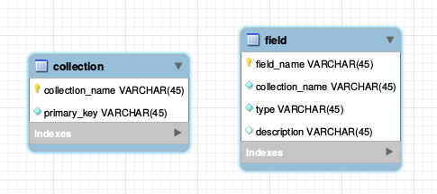

# populse_db  

SQLAlchemy based database API for Populse

# Website

The documentation is available on populse_db's website here: [https://populse.github.io/populse_db](https://populse.github.io/populse_db)

# Tools

The API can support every database type, it takes an engine as entry

The database is managed thanks to the ORM SQLAlchemy

# Relational schema

Type {string, integer, float, date, datetime, time, json, list_string, list_integer, list_float, list_date, list_datetime, list_time, list_json}
	
# Installation

python directory must be added to $PYTHONPATH 

# Import

	import populse_db
	
# Tests

Unit tests written thanks to the python module unittest

Tested with Python2 and Python3

# Launch the tests

Add the directory python/populse_db in $PATH, or open this directory inside a terminal
	
	python2 Test.py  # With Python2
	
	python3 Test.py  # With Python3

